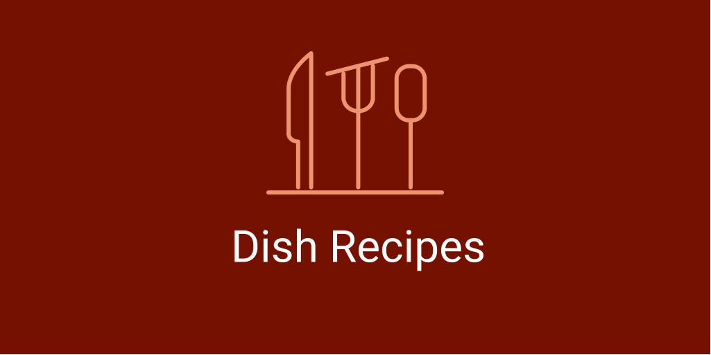
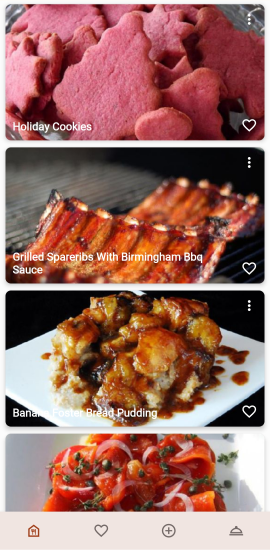
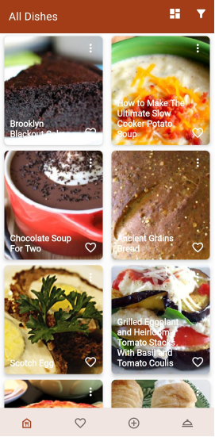
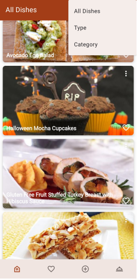
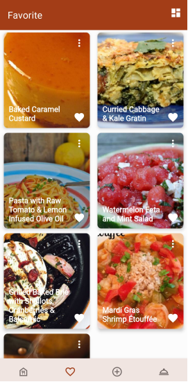
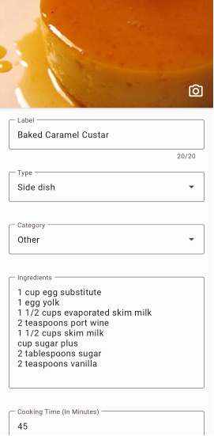
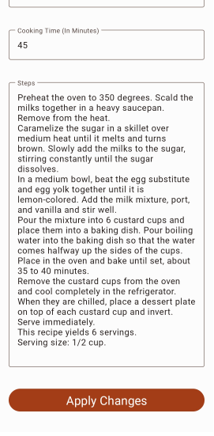
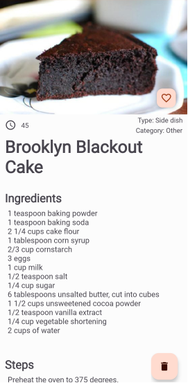
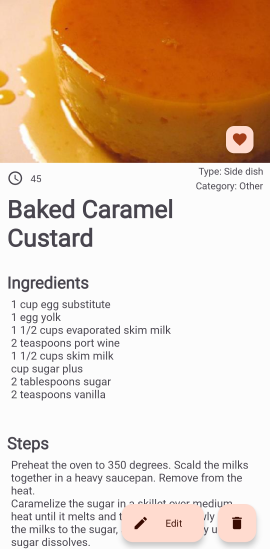
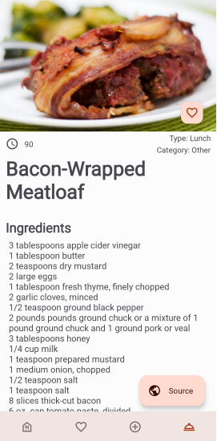

# Dish Recipes

 

_____

## Introductions
Dish Recipes is application where you can store favorite recipes and find new ideas for cooking. Applications is based on modern technologies, such as: MVVM Architecture, Dependency Injection with MultiBinding, Jetpack.
  

## Overview
### All Dishes
All Dishes is a Fragment, where User can see all the recipes ever added. It means that, all dishes created by User and received by Api Call, firstly get there. Furthermore, User can choose how Recipes are displayed, Edit or Delete them and Filter them by Type and Category. Filter list is dynamic, so it will be based on the existing data in Local Repository.
 

  

### Favorite Dishes
_(1st Screenshot below)_ Fragment provides all favorite recipes. Like in the previous fragment, there is available selection of List displaying, Dish Editing and Deleting.
 

  

### Add & Update Dish
_(2nd & 3rd Screenshot above)_ Fragment, where User can add New Dish. In addition it's used for Editing Existed.
  

### Dish Details
Fragment, provides all related information to previously chosen Recipe. There, User can add it to Favorite or Delete. 
 
__NOTE:__ Only created by User Dishes are available for Editing _(1st & 2nd Screenshot below)_
 

  

### Random Dish
Fragment request Api call and provides received Random Recipe to User. Dish automatically saves to local repository. However, recipe Source Link is only available in this fragment and will not be saved _(3rd Screenshot above)_

___

## Technology Stack
- Kotlin
- Jetpack
	- Lifecycle
	- LiveData
	- ViewModel
	- WorkManager
	- Room
	- Navigation Component & safeArgs
- Dagger2
	 - Multibinding
- Retrofit2
- RxJava3
- Glide
